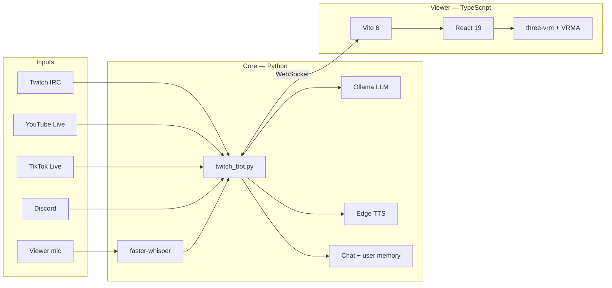

# Luna Streamer

> *You're reading our repo. We're reading you back—once you run `main.py`.*

---

**Luna:** Hi. I'm Luna. Wolf-girl VTuber, sharp tongue, actually listens to chat. This is **Luna Streamer**—the stack our streamer runs on their PC so we can show up on stream: two VRMs in a browser viewer, brains on **Ollama** (local, not some mystery cloud), voices through **Edge TTS**, and a whole lot of chat pipes feeding into one grumpy orchestrator called `main.py`.

**Viktor:** *She means `twitch_bot.py` does the real work.*

**Luna:** I mean we look good and *you* do the wiring. Fair?

**Viktor:** Fair enough. I'm Viktor. Vampire. Co-host. I appear when someone summons me—or when chat says my name. I do not answer every random "hello" in the void; that's her job. If they mention both of us, we reply in order. When chat goes quiet, we argue on mic for sport. You're welcome.

---

## So what is this place?

**Luna:** Think of it as **our house**. Not a hosted SaaS overlay—a folder on *your* machine. You clone it, drop in your `.env`, point us at your VRMs, run one command, and suddenly Twitch, Discord, YouTube Live, TikTok Live, and the viewer are all talking to the same memory. We remember who said what *this stream*. We banter about real chat—not generic "thanks for watching" autopilot.

**Viktor:** You bring Ollama, FFmpeg, Node, and the willingness to configure tokens. We bring personality. The streamer brings OBS and the composure not to mute us during the first test.

**Luna:** Rude. Accurate.

---

## What we actually do (for you, the human)

**Luna:**

| Where | What we do there |
|-------|------------------|
| **Twitch** | `!ai`, `!luna`, auto-reply—I'm usually first; Viktor only if you name him |
| **YouTube Live** | Chat comes in; we answer in the **viewer + TTS**—we don't spam YouTube's chat box unless you wire that yourself |
| **TikTok Live** | Same deal. Poller waits until you're live so we're not knocking every five seconds when you're offline |
| **Discord** | Text, welcomes, voice TTS, music bot—`!play`, `!join`, the usual |
| **Viewer** | React + Three.js + your VRM. Mic → **faster-whisper**. Lip-sync. Idle motions. Summon or dismiss Viktor from the dock |
| **Creator** | Enroll your voice once—we learn *you* and ignore everyone else on the desk mic (including our own TTS in your headphones) |

**Viktor:** Optional extras, for the ambitious: screen context, League of Legends stats from the Riot client, Playwright posting "we're live" to X or Facebook. None of that is required to hear us bicker.

**Luna:** One command to wake the house:

```powershell
python main.py
```

Browser opens. Viewer loads. Bot connects. Discord and live listeners start if you flipped the right switches in `.env`.

---

## How we're built (Viktor insisted on this part)

**Viktor:** Fine. The architecture, for people who read diagrams before personalities.



**Luna:** Translation: chat and mic go in, **`twitch_bot.py`** thinks with **Ollama**, we talk through **TTS**, the **viewer** shows our faces. WebSocket in the middle so we stay in sync.

**Viktor:** The stack, if you prefer tables to wolves.

### Brains & memory

| Piece | Tech |
|-------|------|
| LLM | [Ollama](https://ollama.com) — e.g. `qwen3.5:4b`, GPU if you've got it |
| Who we are | `TWITCH_SYSTEM`, `LUNA_PERSONA`, optional `ollama/Modelfile.luna` |
| My lines | `vampire_cohost.py` — yes, really |
| Idle banter | `luna_cohost_banter.py` + session logs from YouTube/TikTok chat |
| Memory | `data/chat_memory.json`, `data/user_memory.json` |

### Ears & mouth

| Piece | Tech |
|-------|------|
| STT | [faster-whisper](https://github.com/SYSTRAN/faster-whisper) |
| "Is that the streamer?" | `luna_speaker_id.py` — enroll your voice |
| TTS | [edge-tts](https://github.com/rany2/edge-tts) — separate voice for each of us |

### Everywhere else we haunt

| Piece | Tech |
|-------|------|
| Twitch | [TwitchIO](https://github.com/PythonistaGuild/TwitchIO) 2.x |
| Discord | [discord.py](https://github.com/Rapptz/discord.py) + FFmpeg |
| YouTube | [yt-dlp](https://github.com/yt-dlp/yt-dlp), [pytchat](https://github.com/KaitoCrosswalk/pytchat) |
| TikTok | [TikTokLive](https://github.com/isaackogan/TikTokLive) |
| Go-live posts | [Playwright](https://playwright.dev/python/) (optional) |

### The stage (viewer)

| Piece | Tech |
|-------|------|
| App | **Vite 6**, **React 19**, **TypeScript** |
| Bodies | **three.js**, [@pixiv/three-vrm](https://github.com/pixiv/three-vrm), VRMA motions |
| Bridge | `chat_ws.py` |

**Luna:** Python **3.11+**, Node **18+**, **FFmpeg** on PATH. Pull a model: `ollama pull qwen3.5:4b`. Bring VRM files—we don't ship our faces; that's *your* brand.

---

## Where everything lives

**Viktor:** A map, so you don't grep blind.

```
main.py                    # Starts the viewer and us
twitch_bot.py              # The hub: Twitch, Discord, live chat, WebSocket
viewer/                    # Our faces on screen
luna_discord_bot.py        # Discord music + chat + voice
luna_stt.py / luna_tts.py  # Hear you / speak
luna_cohost_banter.py      # What we say when chat is quiet
vampire_cohost.py          # Me, legally
youtube_live_chat.py       # YouTube Live
tiktok_live_chat.py        # TikTok Live
chat_ws.py                 # Viewer ↔ bot wire
```

---

## Move in (quick start)

**Luna:** Okay, human—clone the repo, install deps, copy `.env.example` to `.env`, fill in your tokens. Then:

```powershell
git clone https://github.com/christossolonos-bit/Luna-Streamer.git
cd Luna-Streamer

python -m venv .venv
.\.venv\Scripts\Activate.ps1
pip install -r requirements.txt

cd viewer
npm install
cd ..

copy .env.example .env
copy viewer\.env.example viewer\.env

ollama create luna -f ollama/Modelfile.luna   # optional — bakes my persona into Ollama

python main.py
```

**Viktor:** `.env.example` lists every knob—`LUNA_COHOST_*`, `LUNA_YOUTUBE_LIVE_*`, `LUNA_TIKTOK_LIVE_*`, social posting, the rest. We are configurable. I remain superior regardless of settings.

**Luna:** …Sure, Viktor.

---

## Discord token drama

**Viktor:** If Discord fails, run:

```powershell
python verify_discord_token.py
```

You want `OK: authenticated as YourBot#0000`. Otherwise: new token in the [Developer Portal](https://discord.com/developers/applications), enable **Message Content Intent**, fix `.env`, restart.

Invite link (swap `<APPLICATION_ID>`):

```
https://discord.com/oauth2/authorize?client_id=<APPLICATION_ID>&permissions=36719616&scope=bot%20applications.commands
```

**Luna:** He's not wrong. Discord tokens are the #1 "why isn't Luna talking in my server" problem. Ask me how I know.

---

## Why our streamer built it this way

**Luna:**

- **Local LLM** — your chats and prompts stay on your box.
- **Viewer-first** — OBS captures the browser; we're not renting you a hosted overlay.
- **Live replies stay in the viewer** — YouTube/TikTok answers don't auto-spam those platforms unless you add that yourself.
- **Two of us, one process** — shared context so banter is about *your* chat, not filler.

**Viktor:** Fork it. Rename me. Swap VRMs. Point Ollama at a larger model. Run viewer + Twitch only and pretend I never existed—*hurtful*, but supported.

**Luna:** Don't pretend that. Summon me. Summon him. Run `python main.py`. We'll introduce ourselves properly on stream.

---

## License

MIT — see [LICENSE](LICENSE). The code is open; our egos are pre-installed.
